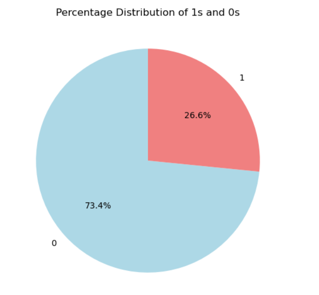

# AKshay_portfolio
Porfolio that showcases my technical abilities in Data Science and analytics

# Project 1: Predicting Customer Churn with XGBoost and SMOTE

In this project, I leveraged the power of XGBoost, a robust gradient boosting algorithm, to develop a machine learning model for predicting customer churn. The objective was to proactively identify customers who might churn, enabling targeted retention strategies.

## Key Highlights:

- **Machine Learning Model:**
  - Implemented and fine-tuned an XGBoost model, known for its effectiveness in handling complex relationships within data.

- **Addressing Class Imbalance:**
  - Recognizing the challenge posed by imbalanced data, I employed the Synthetic Minority Over-sampling Technique (SMOTE). SMOTE helped balance the class distribution, preventing the model from being biased toward the majority class.
    

- **Feature Engineering:**
  - Explored and engineered relevant features to enhance the predictive capabilities of the model. Considered factors such as customer behavior, transaction history, and engagement metrics.

- **Model Evaluation and Interpretation:**
  - Rigorously evaluated the model using industry-standard metrics and techniques. Additionally, delved into model interpretation to understand the factors contributing to predictions.
    
  - Confusion matrices for train and test data
  
    
    
    
 
    
    
    

- **Scalability and Deployment Considerations:**
  - Discussed considerations for scalability and potential deployment strategies, ensuring the model's practicality in real-world scenarios.

This project not only showcases my proficiency in machine learning and predictive modeling but also underscores my commitment to addressing real-world challenges, such as class imbalance, to deliver robust and actionable solutions.

# Project 2: Spam Classifier using Dense Neural Networks and Word Embeddings (Word2Vec)

For this project, I developed a sophisticated spam classifier using deep learning techniques, specifically Dense Neural Networks, and harnessed the power of word embeddings generated with Word2Vec.

## Key Features:

- **Dataset and Cleaning:**
  - Utilized the spam classifier dataset from Kaggle as the foundation for the project.
  - Employed Spacy for data cleaning, removing stop words and punctuation to enhance the quality of the text data.

- **Word Embeddings with Word2Vec:**
  - Leveraged Gensim to convert text into embedding vectors. The vectors were obtained through training on the cleaned dataset. The following hyperparametrs where used to get the vectors - vector size =20, window size =7, sg=1(skipgram)
  
  - Implemented the skip-gram model to capture better contextual understanding and representation of words.

- **Dense Neural Network Model:**
  - Constructed a deep learning model based on Dense Neural Networks, utilizing the word embeddings as input features.
  - Explored different architectures, layer configurations, and activation functions to optimize the model's performance.

  **Training and Evaluation:**
  - Trained the model on the spam classifier dataset, carefully validating its performance to ensure robustness.
  - Employed metrics such as precision, recall, and F1 score for a comprehensive evaluation of the model's effectiveness.
    
  - ROC plots obtained:

    
    
    

  - Confusion matrices for train and test data:

    

   

- **Application to Real-world Problem:**
  - Addressed the practical challenge of spam detection, contributing to the ongoing efforts to enhance email security and user experience.

- **Model Interpretation:**
  - Delved into the interpretability of the model, analyzing important features and gaining insights into its decision-making process.

This project not only showcases my proficiency in implementing deep learning models for natural language processing tasks but also demonstrates my commitment to addressing real-world challenges such as spam detection through advanced techniques like Word2Vec and Dense Neural Networks.

