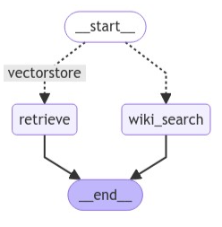

# Portfolio_Akshay_Kamoji 
Porfolio that showcases my technical abilities in AI and analytics.

# Project 1: Multi Actor LLM using Langraph and AstraDB
This project implements a **multi-actor LLM** using **Langraph** for efficient state management. It integrates **WikiSearch API** for knowledge retrieval and **AstraDB** for scalable data storage.  

link to the [Jupyter Notebook](https://github.com/aksh371/Langraph-AI-Agent/blob/main/3_Langraph_With_Astradb.ipynb)

## 🛠 Tech Stack  
- **Langraph** – Manages multi-actor interactions and state transitions  
- **AstraDB** – Provides scalable and efficient data storage  
- **WikiSearch API** – Enhances LLM responses with external knowledge  
- **FastAPI & Python** – Backend API and LLM orchestration  

## 🔹 Features  
✅ **Multi-actor state management** using Langraph  
✅ **Real-time knowledge retrieval** from Wikipedia via WikiSearch API  
✅ **Scalable storage** with AstraDB  
✅ **Optimized query processing** for fast response times  

# Project 2: Predicting Customer Churn with XGBoost and SMOTE 
link to the [Project Repository ](https://github.com/aksh371/Telco-Customer-Churn-kaggle)

link to the [Jupyter Notebook](https://github.com/aksh371/Telco-Customer-Churn-kaggle/blob/main/XGBoost%20Telco.ipynb)

In this project, I leveraged the power of XGBoost, a robust gradient boosting algorithm, to develop a machine learning model for predicting customer churn. The objective was to proactively identify customers who might churn, enabling targeted retention strategies.

- **Machine Learning Model:**
  - Implemented and fine-tuned an XGBoost model, known for its effectiveness in handling complex relationships within data.

- **Addressing Class Imbalance:**
  - Recognizing the challenge posed by imbalanced data, I employed the Synthetic Minority Over-sampling Technique (SMOTE). SMOTE helped balance the class distribution, preventing the model from being biased toward the majority class.
    

- **Feature Engineering:**
  - Explored and engineered relevant features to enhance the predictive capabilities of the model. Considered factors such as customer behavior, transaction history, and engagement metrics.

- **Model Evaluation and Interpretation:**
  - Rigorously evaluated the model using industry-standard metrics and techniques. Additionally, delved into model interpretation to understand the factors contributing to predictions.

- **Scalability and Deployment Considerations:**
  - Discussed considerations for scalability and potential deployment strategies, ensuring the model's practicality in real-world scenarios.

This project not only showcases my proficiency in machine learning and predictive modeling but also underscores my commitment to addressing real-world challenges, such as class imbalance, to deliver robust and actionable solutions.

# Project 3: Spam Classifier using Dense Neural Networks and Word Embeddings (Word2Vec)

link to the [repository](https://github.com/aksh371/Spam-Classifier-using-word-embedding)

link to the [Jupyter Notebook](https://github.com/aksh371/Spam-Classifier-using-word-embedding/blob/main/Spam%20classifier%20using%20word%20embeddings(word2vec).ipynb)

For this project, I developed a sophisticated spam classifier using deep learning techniques, specifically Dense Neural Networks, and harnessed the power of word embeddings generated with Word2Vec.

## Key Features:

- **Dataset and Cleaning:**
  - Utilized the spam classifier dataset from Kaggle as the foundation for the project.
  - Employed Spacy for data cleaning, removing stop words and punctuation to enhance the quality of the text data.

- **Word Embeddings with Word2Vec:**
  - Leveraged Gensim to convert text into embedding vectors. The vectors were obtained through training on the cleaned dataset. The following hyperparametrs where used to get the vectors - vector size =20, window size =7, sg=1(skipgram)  
  - Implemented the skip-gram model to capture better contextual understanding and representation of words.

- **Dense Neural Network Model:**
  - Constructed a deep learning model based on Dense Neural Networks, utilizing the word embeddings as input features.
  - Explored different architectures, layer configurations, and activation functions to optimize the model's performance.

  **Training and Evaluation:**
  - Trained the model on the spam classifier dataset, carefully validating its performance to ensure robustness.
  - Employed metrics such as precision, recall, and F1 score for a comprehensive evaluation of the model's effectiveness.

- **Application to Real-world Problem:**
  - Addressed the practical challenge of spam detection, contributing to the ongoing efforts to enhance email security and user experience.

- **Model Interpretation:**
  - Delved into the interpretability of the model, analyzing important features and gaining insights into its decision-making process.

This project not only showcases my proficiency in implementing deep learning models for natural language processing tasks but also demonstrates my commitment to addressing real-world challenges such as spam detection through advanced techniques like Word2Vec and Dense Neural Networks.

# Project 4: Visualizing COVID-19 Vaccination Patterns in the US using Tableau

link to the [repository](https://github.com/aksh371/US-Covid-vaccinations)

link to the [Tableau file (raw)](https://github.com/aksh371/US-Covid-vaccinations/blob/main/proj_final.twbx)

Link to the [tableau public visualization](https://public.tableau.com/app/profile/akshay.kamoji/viz/proj_final5/Story1?publish=yes)

In this project, I utilized Tableau to create insightful visualizations of COVID-19 vaccination patterns in the United States. Leveraging data from the CDC website, I aimed to provide a comprehensive understanding of vaccination trends based on diverse criteria, including state-wise distribution and vaccination progress over time.

## Key Achievements:

- **Data Collection and Preprocessing:**
  - Collected COVID-19 vaccination data from the CDC website, ensuring data accuracy and completeness.
  - Preprocessed the data in R, utilizing time series imputation methods to handle missing values. This step was crucial for maintaining the integrity of the visualizations.

- **Tableau Visualizations:**
  - Developed a series of interactive dashboards using Tableau to showcase vaccination patterns. These dashboards enable users to explore the data dynamically, gaining insights into state-level variations and temporal trends.
 

- **Exploratory Data Analysis:**
  - Conducted exploratory data analysis within Tableau, uncovering key patterns and correlations. This involved analyzing vaccination rates, identifying hotspots, and assessing the impact of vaccination campaigns.      

- **Effect Exploration:**
  - Explored the effects of various factors, including political influences, weather conditions, time, and state-specific dynamics, on vaccination patterns.

- **Storytelling through Data Visualization:**
  - Crafted a compelling narrative by arranging visualizations into a cohesive story. This approach enhances the communicative power of the project, making complex vaccination data more accessible to a broad audience.

- **User Interaction Features:**
  - Implemented features for user interaction within Tableau, allowing viewers to filter and drill down into specific aspects of the data. This enhances the overall user experience and facilitates deeper exploration.

This project not only demonstrates my proficiency in data visualization but also showcases my ability to extract meaningful insights from complex datasets, contributing to a better understanding of COVID-19 vaccination trends in the US.

# Project 5: Understanding the Impact of Shall Carry Laws on Crime Rates using Time Series Fixed Effects Model

link to the [repository](https://github.com/aksh371/Stata-analysis)

link to the [Stata file (raw)](https://github.com/aksh371/Stata-analysis/blob/main/guns_2.dta)

In this project, I conducted a comprehensive investigation into the relationship between Shall Carry Laws in the United States and crime rates. Leveraging data from [Princeton University's Stock-Watson Empirical Exercises datasets](https://www.princeton.edu/~mwatson/Stock-Watson_3u/Students/Stock-Watson-EmpiricalExercises-DataSets.htm), I applied a time series fixed effects model to unravel patterns and discern the impact of various factors on crime rates.

## Key Components:

- **Exploratory Data Analysis (EDA) in Stata:**
  - Initiated the project with a meticulous EDA in Stata to gain insights into trends and patterns in the data.
  - Explored statistical summaries, visualizations, and correlations to inform subsequent steps.

    

       <!-- Adding line breaks for spacing -->

    

- **Data Preprocessing:**
  - Addressed issues related to data distribution and multicollinearity through preprocessing techniques.
  - Ensured the quality and reliability of the data before proceeding with model development.
 
- **Model Building and inference:**
  - Built Pooled OLS and fixed effect model regression models to understand the effect of shall carry laws on crime rates for each state
  - Interpreted the coefficients to understand the effect

